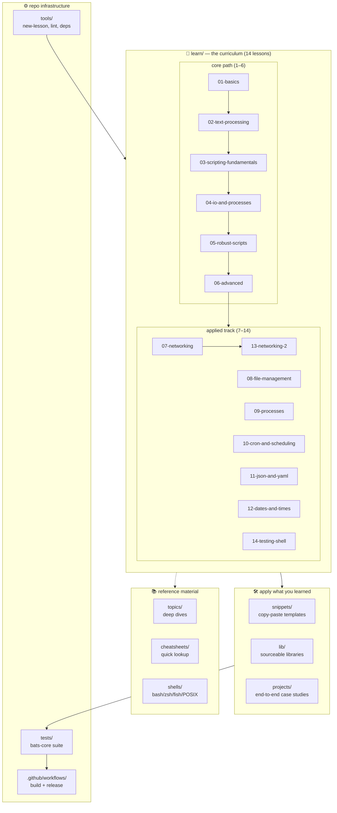

<div align="center">

# Shell Mastery — From First Terminal to Production Bash

**A structured learning repository for Unix shell — bilingual notes, runnable examples, tested libraries, and real projects, from `ls` to `set -euo pipefail`.**

Fourteen shipped lessons in total, plus five deep-dive topics, seven cheatsheets, four shell comparisons, two real-world projects, and a sourceable library — everything shellcheck-clean, tested where behavior is stable, and CI-verified.

     

⚙️ [Overview](#%EF%B8%8F-overview) · 🎯 [Outcomes](#-outcomes) · 🧠 [Philosophy](#-philosophy) · 📖 [Learning Path](#-learning-path) · 🧩 [Projects](#-projects) · 🏛️ [Architecture](#%EF%B8%8F-architecture) · 🚀 [Quick Start](#-quick-start) · 📚 [Documentation](#-documentation)

</div>

---

## ⚙️ Overview

`shell-mastery` is a personal-learning repo built as a **complete curriculum**, not a link dump or a set of scattered snippets. It takes a reader from `ls` and `cd` on day one to writing production-grade bash on day thirty — with every concept demonstrated by runnable scripts, stable interfaces covered by bats, and the repo kept lint-clean under shellcheck.

Every lesson ships in both **English** and **Vietnamese** (`en/` + `vi/` subfolders), while code and code comments stay English-only so examples read consistently regardless of which language column you follow.

The repository is opinionated: bash 4+, strict mode by default, shellcheck-as-CI, bats-tests-alongside-code. Those aren't arbitrary — they're the habits that separate scripts that work on your laptop from scripts that survive a production Sunday morning.

---

## 🎯 Outcomes

By the end of the lesson track, you will be able to:

1. **Navigate and combine tools fluently** — pipe `grep | awk | sort` without hesitation, know when to reach for `xargs -P` vs a `for` loop, quote correctly on the first try.
2. **Write scripts that fail loudly, not silently** — strict mode, input validation at the boundary, atomic writes with `mv`, cleanup on exit and signals.
3. **Debug systematically** — `set -x`, `PS4`, `trap ERR`, and read shellcheck warnings without googling every code.
4. **Recognize shell's limits** — spot the tasks that have outgrown shell and reach for `awk`, Python, or Go with confidence.
5. **Start testing your bash with confidence** — read and extend bats suites for real scripts, then work through the dedicated testing lesson to learn fixtures, failure-path assertions, and tempdir-driven tests.
6. **Read someone else's script and understand what it does** — including the reasons for its safety patterns.

If you're already fluent in the full lesson track, this repo is not for you — see [`resources.md`](resources.md) for the next level.

---

## 🧠 Philosophy

> "Read to understand, run to internalize, break to remember."

Shell Mastery is built around five principles:

1. **Learner-first, not reference-dump** — content is chosen for someone working sequentially through the curriculum, not for exhaustive coverage.
2. **Every stable interface has a test** — `lib/` and `projects/` are bats-tested; lesson examples stay small and readable, and `snippets/` remain copy-paste templates.
3. **Bilingual prose (`en/` + `vi/`) in `learn/`, English everywhere else** — code, comments, topics, and cheatsheets don't fork across languages.
4. **CI is the enforcer** — shellcheck-clean and bats-green are hard gates, not aspirations.
5. **Depth beats velocity** — one well-tested lesson beats three rushed lessons.

---

## 📖 Learning Path

The `learn/` track now contains fourteen shipped lessons. Each lesson has `en/{notes,exercises,solutions}.md`, `vi/{notes,exercises,solutions}.md`, and `examples/`.

| # | Lesson | English | Vietnamese | ~Time | Status |
| --- | --- | --- | --- | --- | --- |
| 1 | Basics — cd, ls, pipes, redirect, quoting | [en](learn/01-basics/en/notes.md) | [vi](learn/01-basics/vi/notes.md) | 2h | 🟢 shipped |
| 2 | Text processing — grep, sed, awk, cut, sort, uniq | [en](learn/02-text-processing/en/notes.md) | [vi](learn/02-text-processing/vi/notes.md) | 3h | 🟢 shipped |
| 3 | Scripting fundamentals — variables, if, loops, functions, exit codes | [en](learn/03-scripting-fundamentals/en/notes.md) | [vi](learn/03-scripting-fundamentals/vi/notes.md) | 3h | 🟢 shipped |
| 4 | I/O and processes — subshell, xargs, trap, signals, jobs | [en](learn/04-io-and-processes/en/notes.md) | [vi](learn/04-io-and-processes/vi/notes.md) | 3h | 🟢 shipped |
| 5 | Robust scripts — `set -euo pipefail`, IFS, error handling | [en](learn/05-robust-scripts/en/notes.md) | [vi](learn/05-robust-scripts/vi/notes.md) | 2h | 🟢 shipped |
| 6 | Advanced — arrays, associative arrays, parameter expansion, coproc | [en](learn/06-advanced/en/notes.md) | [vi](learn/06-advanced/vi/notes.md) | 3h | 🟢 shipped |
| 7 | Networking — `curl`, `ssh`, `scp`, DNS, ports | [en](learn/07-networking/en/notes.md) | [vi](learn/07-networking/vi/notes.md) | 2h+ | 🟢 shipped |
| 8 | File management — `find`, `tar`, `rsync`, safe delete | [en](learn/08-file-management/en/notes.md) | [vi](learn/08-file-management/vi/notes.md) | 2h+ | 🟢 shipped |
| 9 | Processes — inspect, signal, background, priority | [en](learn/09-processes/en/notes.md) | [vi](learn/09-processes/vi/notes.md) | 2h+ | 🟢 shipped |
| 10 | Cron and scheduling — cron, timers, `flock` | [en](learn/10-cron-and-scheduling/en/notes.md) | [vi](learn/10-cron-and-scheduling/vi/notes.md) | 2h+ | 🟢 shipped |
| 11 | JSON and YAML — `jq`, `yq`, structured data | [en](learn/11-json-and-yaml/en/notes.md) | [vi](learn/11-json-and-yaml/vi/notes.md) | 2h+ | 🟢 shipped |
| 12 | Dates and times — epoch, UTC, GNU/BSD `date` | [en](learn/12-dates-and-times/en/notes.md) | [vi](learn/12-dates-and-times/vi/notes.md) | 1.5h+ | 🟢 shipped |
| 13 | Networking 2 — tunnels, proxies, `nc` workflows | [en](learn/13-networking-2/en/notes.md) | [vi](learn/13-networking-2/vi/notes.md) | 2h+ | 🟢 shipped |
| 14 | Testing shell — bats, fixtures, failure-path tests | [en](learn/14-testing-shell/en/notes.md) | [vi](learn/14-testing-shell/vi/notes.md) | 2h+ | 🟢 shipped |

All fourteen lessons are present in-tree with notes, exercises, solutions, and runnable examples. Full study loop, prerequisites, and FAQ live in [`learn/INDEX.md`](learn/INDEX.md).

---

## 🧩 Projects

End-to-end case studies. Read them after finishing the lessons — each demonstrates skills from at least three lessons, ships with a full bats suite, and follows every convention this repo enforces.

| Project | Purpose | Skills demonstrated | Status |
| --- | --- | --- | --- |
| [`backup-tool`](projects/backup-tool/) | Timestamped atomic tar+gzip backups with retention | `getopts` + long args, `trap EXIT`, atomic `mv`, `mapfile`, dry-run pattern, input validation | 🟢 shipped |
| [`log-analyzer`](projects/log-analyzer/) | Summarize Combined Log Format access logs from stdin or file | pipeline composition, `awk` aggregation, stdin fallback, temp file cleanup | 🟢 shipped |

More planned in [`ROADMAP.md`](ROADMAP.md): dotfiles installer, SSH tunnel supervisor, repo audit, disk usage alerter, log rotator, Prometheus textfile exporter.

---

## 🏛️ Architecture

The repository is organized so a learner follows a **linear path** through `learn/`, while a working developer can jump straight into `topics/`, `cheatsheets/`, or `lib/` as reference.



Each directory is scoped to a single purpose. Every `.sh` file passes shellcheck; every `lib/` and `projects/` entry has a bats test.

---

## 🚀 Quick Start

### 1. Prerequisites

You need bash 4+. On macOS the default `/bin/bash` is 3.2 — install a modern one:

```sh
brew install bash                          # macOS
sudo apt install bash                      # already there on most Linux
```

On macOS, verify that your shell is actually finding the Homebrew Bash rather than `/bin/bash`:

```sh
which bash
bash --version
```

Expected output:

```sh
/.../bin/bash
GNU bash, version 5.x
```

On Apple Silicon Macs that path is usually `/opt/homebrew/bin/bash`. On Intel Macs it is usually `/usr/local/bin/bash`.

If `which bash` still prints `/bin/bash`, put Homebrew's bin directory first in your startup config and restart your shell:

```sh
echo 'export PATH="$(brew --prefix)/bin:$PATH"' >> ~/.zprofile
exec zsh
which bash
```

Recommended tooling:

```sh
brew install shellcheck bats-core shfmt    # macOS
sudo apt install shellcheck bats           # Debian/Ubuntu
```

`shellcheck` and `bats` are the actual requirements for the repo checks below. `shfmt` is recommended and reported by `tools/check-deps.sh` when present, but it is currently optional.

Verify everything is ready:

```sh
./tools/check-deps.sh
```

### 2. Read the study guide

```sh
$EDITOR learn/INDEX.md                     # study order + how to work through a lesson
```

### 3. Do your first lesson

```sh
# Read the notes (choose your language)
$EDITOR learn/01-basics/en/notes.md
# or:
$EDITOR learn/01-basics/vi/notes.md

# Run the examples — then modify one line and predict the result
bash learn/01-basics/examples/01-redirect.sh
bash learn/01-basics/examples/02-quoting.sh

# Attempt exercises honestly, then compare
$EDITOR learn/01-basics/en/exercises.md
$EDITOR learn/01-basics/en/solutions.md
```

### 4. Scaffold new content

```sh
./tools/new-lesson.sh 15-your-topic        # creates learn/15-your-topic/{en,vi,examples}
```

Then add a row to [`learn/INDEX.md`](learn/INDEX.md).

### 5. Lint and test

```sh
./tools/lint-all.sh                        # shellcheck on every .sh file
bats tests/                                # run the bats suite
```

CI runs both on PRs targeting `main`, pushes to `main`, the weekly scheduled run, and manual dispatches — see [`.github/workflows/build.yml`](.github/workflows/build.yml).

---

## 📚 Documentation

Everything is documented in-tree. Each major area has its own entry document, usually a `README.md` and, for `learn/`, the main index at `learn/INDEX.md`.

| Path | What lives here |
| --- | --- |
| [`learn/`](learn/) — [`INDEX.md`](learn/INDEX.md) | The lessons. Start here. |
| [`topics/`](topics/) | Cross-cutting deep dives: quoting, shellcheck, debugging, performance, portability. |
| [`cheatsheets/`](cheatsheets/) | One-page quick references: redirect, grep, sed, awk, arrays, parameter expansion, test. |
| [`shells/`](shells/) | Comparisons: bash, zsh, fish, POSIX sh. |
| [`snippets/`](snippets/) | Copy-paste templates: getopts, long-flag argparse. |
| [`lib/`](lib/) | Sourceable libraries with tests: logger, retry, tempdir, strings. |
| [`projects/`](projects/) | Real, tested scripts as case studies. |
| [`tests/`](tests/) | bats-core suite mirroring `lib/` and `projects/` paths. |
| [`tools/`](tools/) | Repo-management scripts: new-lesson, lint-all, check-deps. |
| [`resources.md`](resources.md) | Curated external references — must-reads, tools, books, blogs. |
| [`CHANGELOG.md`](CHANGELOG.md) | Every version, what changed, when. |
| [`ROADMAP.md`](ROADMAP.md) | Planned lessons, projects, tools, and explicit non-goals. |

---

## 🛡️ Conventions

Every shell script in this repo — examples, snippets, projects, tools — follows these rules. Adopt them in your own work:

```sh
#!/usr/bin/env bash          # portable shebang
set -euo pipefail            # fail loud on errors, unset vars, pipe failures
IFS=$'\n\t'                  # (in robust scripts) don't split on spaces
```

- **Every `lib/` and `projects/` entry has a bats test**, mirrored under `tests/`. `learn/` examples are intentionally lightweight and `snippets/` are templates, not stable interfaces.
- **shellcheck must pass** at `--severity=warning`. `# shellcheck disable=...` requires a comment explaining why.
- **Commits reference the lesson**: `feat(learn/02): add sed portability example` or `fix(projects/backup-tool): atomic mv on same fs`.
- **Prose is bilingual (`en/` + `vi/`) in `learn/` only**. Everything else stays English.
- **Semantic versioning** applies to `lib/` public interfaces from `0.1.0` onward — see [`CHANGELOG.md`](CHANGELOG.md) for the current pre-stable rules.

---

## 🗺️ Roadmap

Highlights from [`ROADMAP.md`](ROADMAP.md):

- **v0.0.2** — coverage polish: deepen the shipped 14-lesson track, add missing cheatsheets, and tighten onboarding docs.
- **v0.0.3** — real-world projects: dotfiles installer, SSH tunnel supervisor, repo audit, disk usage alerter.
- **v0.0.4** — portability & POSIX story: dedicated lesson + tested `#!/bin/sh` companions.
- **v0.0.5** — interactive lesson runner: `./tools/study.sh` guides you through the curriculum.
- **v0.1.0** — first minor bump: stable curriculum, SemVer guarantees on `lib/`, publish rendered site.
- **v1.0.0** — stable API, no more breaking changes without a MAJOR bump.

Full details, non-goals, and how prioritization works: [`ROADMAP.md`](ROADMAP.md).

---

## 🤝 Contributing

Start with [`CONTRIBUTING.md`](CONTRIBUTING.md). It explains:

- what belongs in each top-level folder
- what must be tested
- how to add a lesson, project, library, or topic
- what to run before opening a PR
- how to keep docs, tests, and behavior in sync

Fast path:

```sh
./tools/lint-all.sh
bats tests/
```

CI enforces the same gates.

---

## 👥 Maintainers

**Duc-The Pham** — the author of this repo.

Contributions welcome — see the Contributing section above, or open an issue for anything larger than a typo.

---

## 📄 License

See [`LICENSE`](LICENSE).
